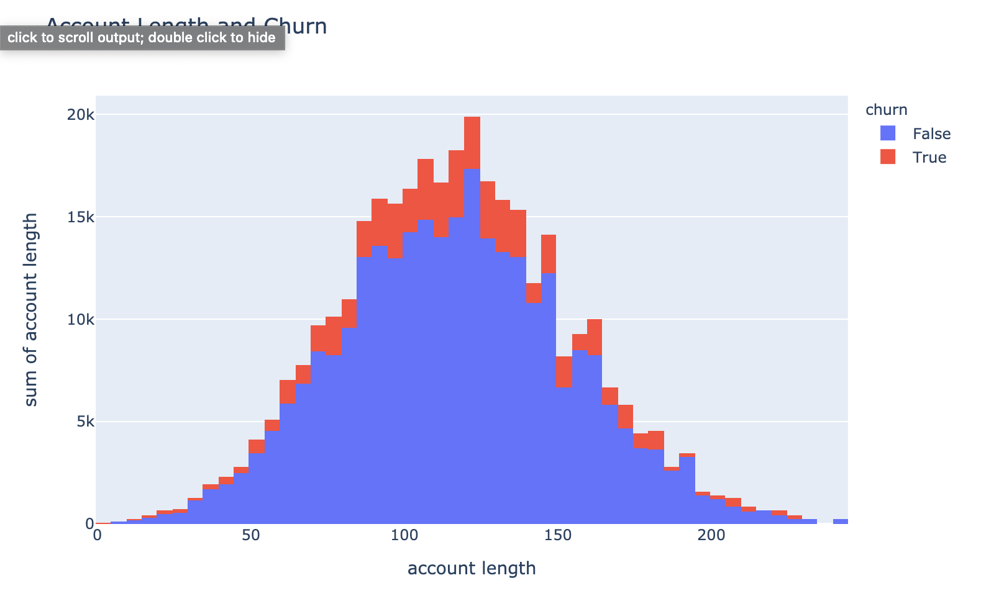
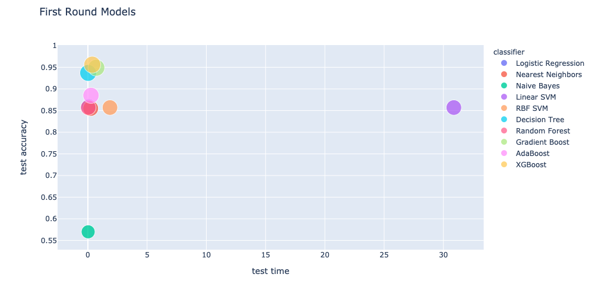
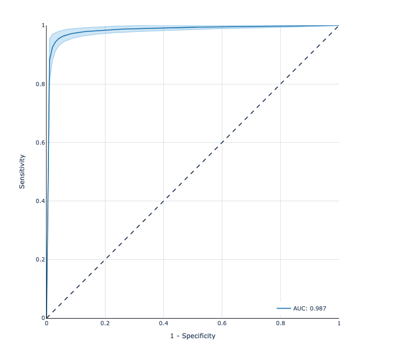

# Predicting SyriaTel Customer Churn

**Author**: <br>[Taylor Hale Robert](mailto:taylorhale11@gmail.com)


## Overview

This project uses a customer account information to predict churn rate.

## Data Sources & Features

[Kaggle Customer Churn](https://www.kaggle.com/becksddf/churn-in-telecoms-dataset) data was used for our analysis

'Churn' is the target variable for this analysis. 

View EDA code [here.](./EDA.ipynb)



## Summary
### Baseline Model

Built initial models using:<br><br>
• Logistic Regression • K Nearest Neighbors • Naive Bayes • Linear SVM •<br>
• RBF SVM • Decision Tree • Random Forest • Gradient Boosting • AdaBoost • XGBoost • <br><br>
**XGBoost** was among the lowest regarding testing and training time and among the highest regarding predictive power, correctly classifying 94% of the testing set before hyperparameter tuning.
   

### Observations
Some of the most important features in determining whether or not SyriaTel retained the customer were: 
<ul><li>total day charge</li>
    <li>international plan participation</li>
    <li>voicemail plan participation</li></ul>

With Total Day Charge being the most important determining feature, I suggest the company implement short term day rate discounts as a customer retention strategy. It would also be helpful to explore marketing strategies regarding international and voicemail plans.

### Final Model
Using gridsearch we tuned the hyperparameters to maximize a balance of precision and recall, with the resulting model configuration correctly classifying customer churn 96% of the time.



## For More Information

See the full analysis in the [Jupyter Notebook](./final-model.ipynb) or review this [presentation](./Churn_Presentation.pdf).

For additional info, contact the author at:<br>
[Taylor Hale Robert](mailto:taylorhale11@gmail.com)


## Repository Structure

```
├── EDA.ipynb
├── final_model.ipynb
├── CODE
│   ├── THR_prelim_modeling.ipynb
│   └── more scratchwork
├── data
│   └── customer_churn.csv
├── images
│   ├── nguyen-dang-hoang-nhu-qDgTQOYk6B8-unsplash.jpg
│   ├── dom-fou-YRMWVcdyhmI-unsplash.jpg
│   ├── EDA.png
│   └── baseline.png
├── .gitignore
├── README.md
└── Churn_Presentation.pdf
